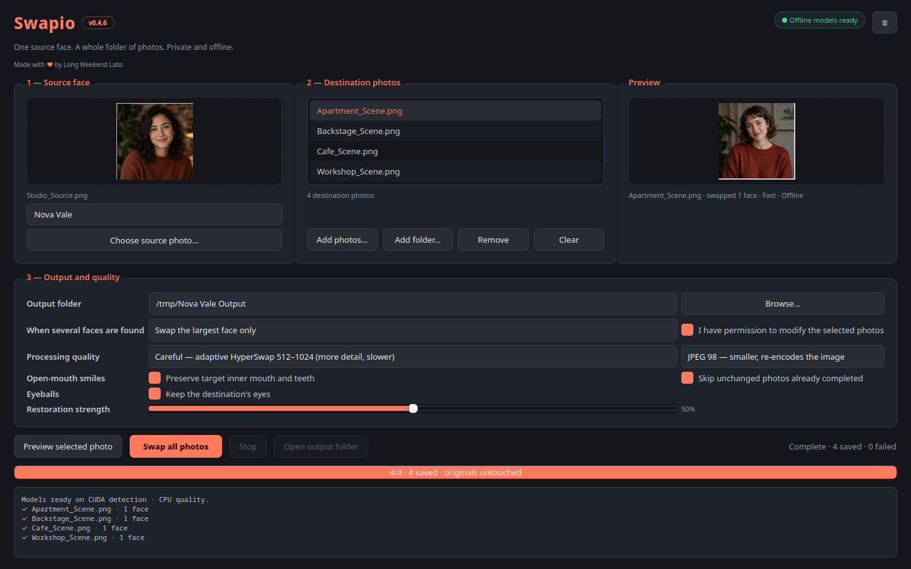
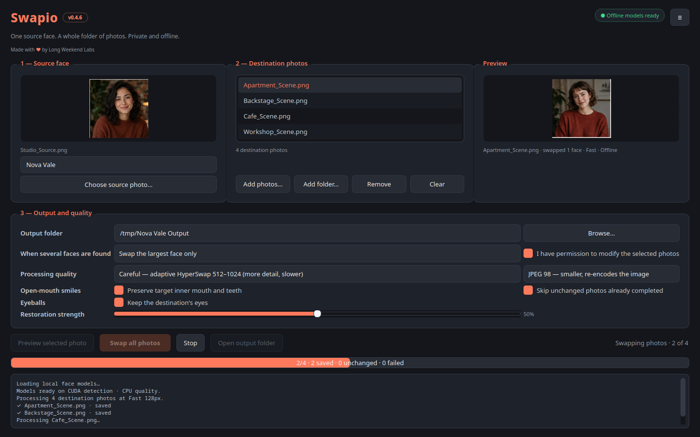

# Swapio

**Offline batch face swapping for still photos.**

Pick one source portrait, point Swapio at a folder of destination photos, and it swaps that face into every one of them. Nothing is uploaded and nothing is sent to a cloud service: after the one-time model download, the app does not use the network at all.

Swapio is free.

### [Download the latest release](https://github.com/longweekendlabs/swapio/releases/latest)

## One face in, a whole folder out

One source portrait per run. Feed it individual photos or a whole folder tree, preview the result before you commit, and choose whether to swap only the largest face in each photo or every face it finds.

Repeat a batch and it processes only new or changed photos by default. A photo that fails is skipped and reported at the end rather than killing the run, so a bad file in the middle of two hundred does not cost you the batch.

## Four quality modes, and they mean something

Best rebuilds the swapped face after the swap, so eyelashes, eyelids, irises and teeth survive at a detail no 256 pixel swapper can reach. Careful works adaptively between 512 and 1024 pixels, detecting close-up faces and raising HyperSwap detail to 768 or 1024 automatically. Balanced runs at 256, and Fast at 128 for drafts.

HyperSwap is the high-detail engine; InSwapper is there when you want a quick draft. On an NVIDIA machine, detection, drafts and face restoration run on CUDA, and restoration falls back to CPU by itself on a card that cannot produce a usable result. HyperSwap quality modes stay on CPU for stability.

## What it preserves

Swapio changes facial identity and leaves everything else alone: the destination pose, expression, body, skin, hair, and image dimensions all stay. Lossless PNG output keeps every pixel outside the face composite exactly as it was decoded.

Inner mouth and teeth are preserved on the target, which is what keeps open-mouth smiles from turning strange. The destination's eyeballs can be kept too, moved onto the swapped eyelids so they line up: a 256 pixel swapper cannot draw a convincing iris, and a real one beats a generated one. Oriented pixels and safe EXIF and ICC metadata are retained where possible. Original files are never modified.

## Download

RPM, DEB and AppImage, for Linux on x86_64 and arm64. Grab one from the [latest release](https://github.com/longweekendlabs/swapio/releases/latest).

The package carries no face models and no CUDA libraries. On first launch Swapio lists the models it needs, downloads them from their original publishers, verifies each checksum, and then never touches the network again. On an NVIDIA machine it uses the CUDA you already have; without one it runs on CPU.

## Formats and naming

Reads `jpg`, `jpeg`, `png`, `webp`, `bmp`, `tif`, and `tiff`. Writes JPEG at quality 98 by default, with lossless PNG available.

Give a run a character name and outputs are named `CharacterName_swapped_DDMMYYYY-HHMMSS.ext`, so a batch stays recognizable months later. Without one, Swapio uses the destination filename.

## Licensing and consent

**Only alter photos you own or have permission to modify.**

The application code and the pretrained models carry different licences. InsightFace states that its downloaded pretrained models are for non-commercial research use, and HyperSwap is published under ResearchRAIL. Review those terms before use; commercial use may require separate permission. Setup keeps models out of git and requires an explicit acknowledgement before it installs anything.

## Scope

Still images only, at version 0.4.5. Video, body reshaping, and character libraries are outside this release. Appearance recolouring was removed after the models evaluated for it failed the quality bar.

## Feedback

[Open an issue](https://github.com/longweekendlabs/swapio/issues) for a bug or a request.

## License

MIT, for Swapio's own code. See [LICENSE](LICENSE). The pretrained models and the libraries bundled in the packages carry their own separate terms, described in [THIRD_PARTY_NOTICES](THIRD_PARTY_NOTICES.md).

© 2026 Long Weekend Labs

---

Made with ♥ by **[Long Weekend Labs](https://github.com/longweekendlabs)**
